# LinkDisk Android App With Backend As Flask Rest Api In MongoDb

>This application handles the users valuable data with encrypted passCode and using face detection.

>

## Features Of Application

&rarr; ToDo App handles your daily routine. some times you forgot to do your works.

&rarr; Our App is very concern about your precious time. 

&rarr; And this app will definitely help you todo your works on very right time.

   Light Splash Screen             |  Dark Spalsh Screen
 :-------------------------:|:-------------------------:
    | 
 

### Login System

 Login With Google Api             |  Generate or Enter Your Passcode
 :-------------------------:|:-------------------------:
    | 
 

//hi

### Login System

 Login With Email orUsername             |  Login Witth Phone
:-------------------------:|:-------------------------:
 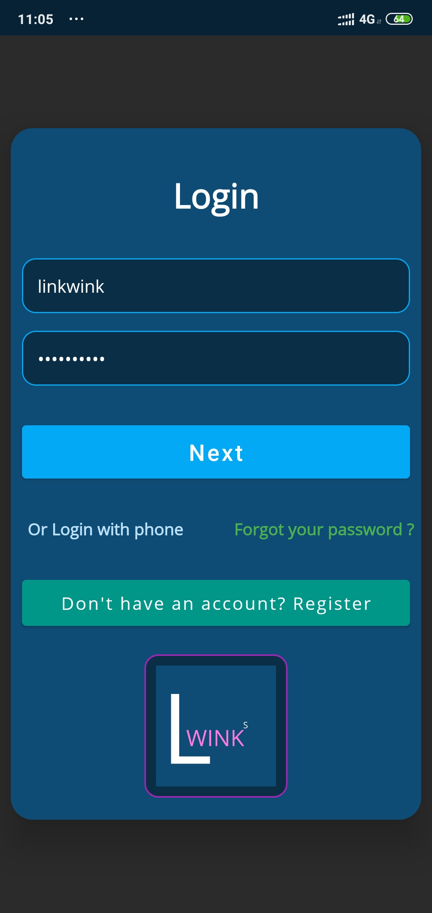  | 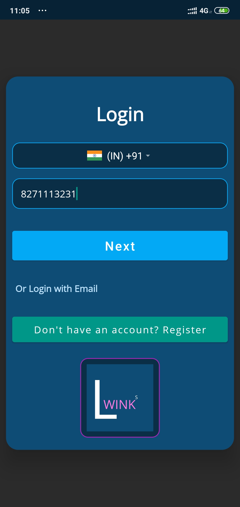

### light mode

Home             |  Settings         |  Add
:-------------------------:|:-------------------------:|:-------------------------:
   |  | 

### Dark  mode

Home             |  Settings         |  Add
:-------------------------:|:-------------------------:|:-------------------------:
   |  | 

User profile             |  User Links         |  User Chat
:-------------------------:|:-------------------------:|:-------------------------:
 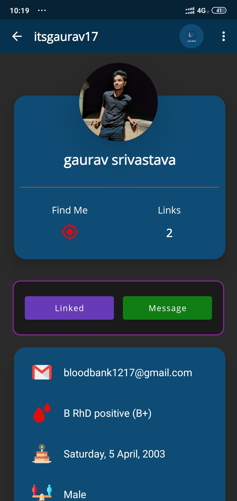  | 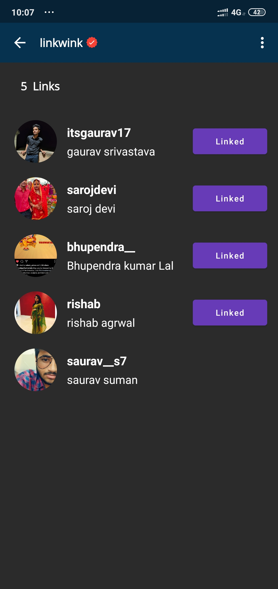 | 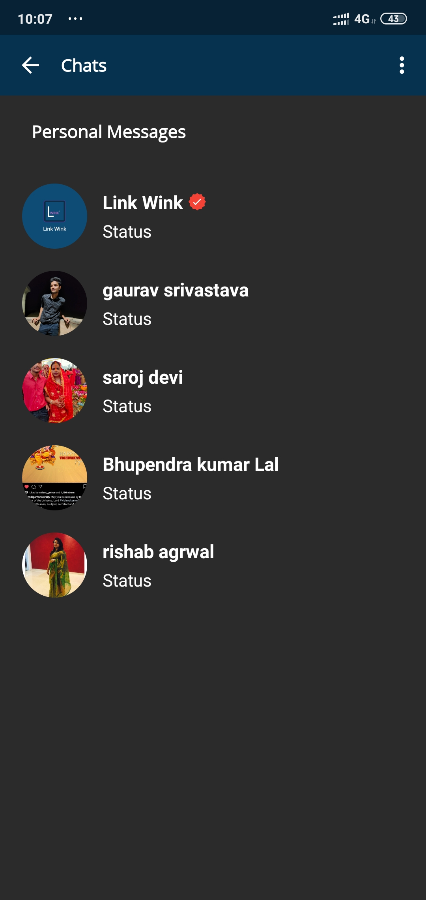

Logout            |  Messages
:-------------------------:|:-------------------------:
 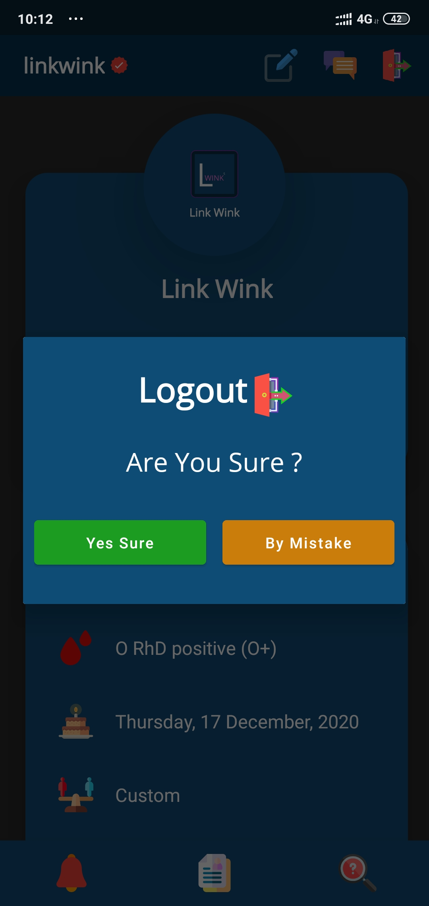  | 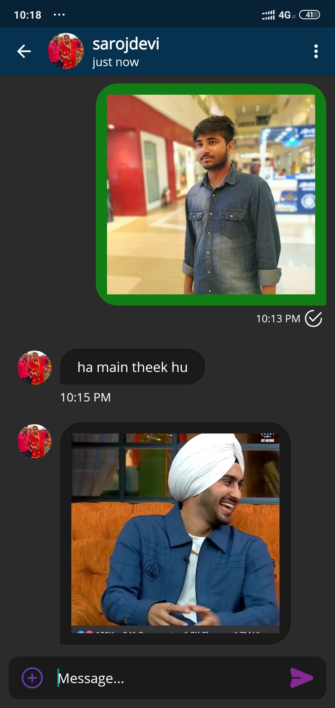

Make Links            |  Link Sent         |  Invitations
:-------------------------:|:-------------------------:|:-------------------------:
 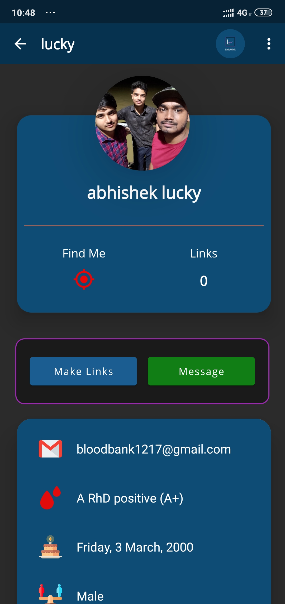  | 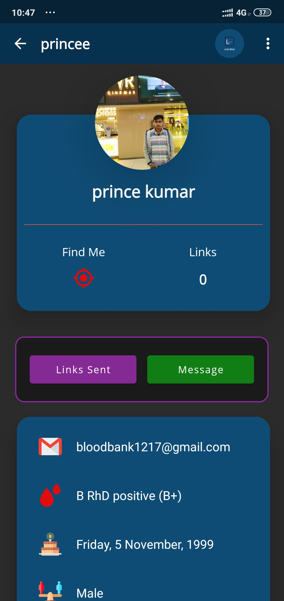 | 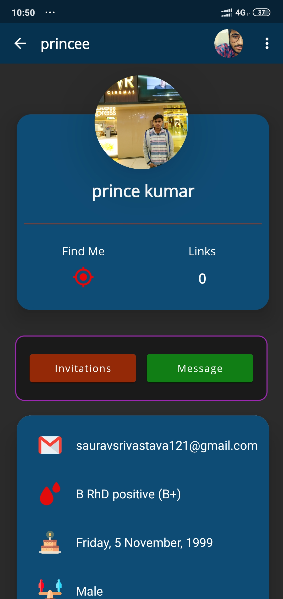

Cancel Requested Links             |  Accept Links         |  Unlinked Links
:-------------------------:|:-------------------------:|:-------------------------:
 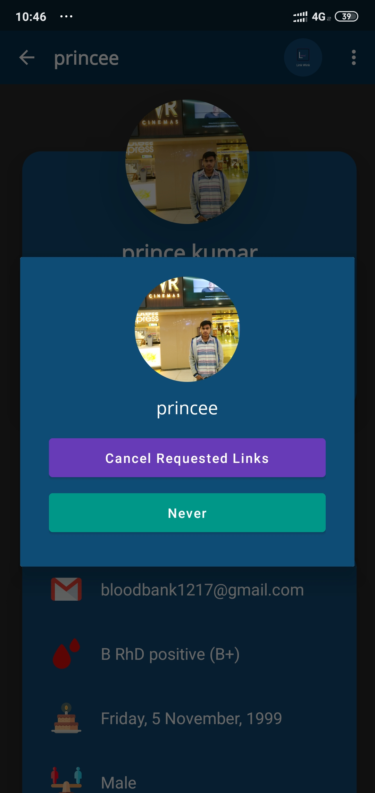  | 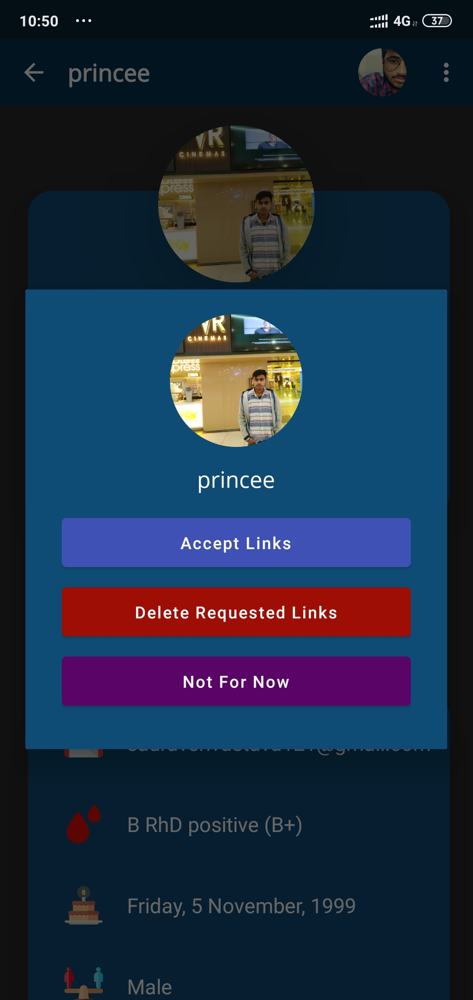 | 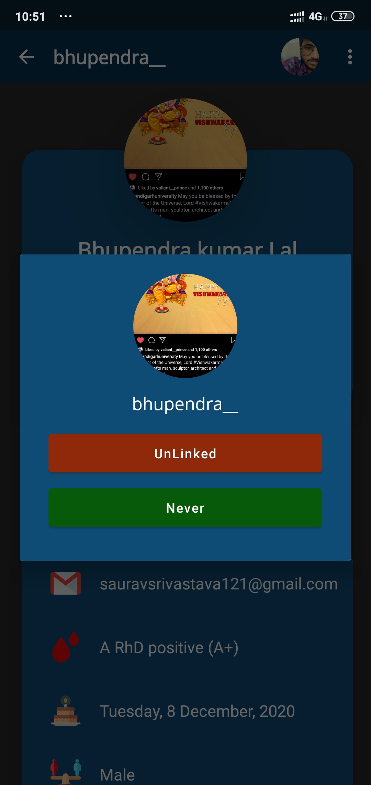

### This is how you can use our software

***
