# LinkDisk Android App With Backend As Flask Rest Api In MongoDb

>This application handles the users valuable data with encrypted passCode and using face detection.

>

## Features Of Application

&rarr; This app features like google drive

&rarr; Where you can eaisly store your data and view your whenever you want

&rarr; This app is in under progress to achieve feature like face detection to secure your and online video streaming

&rarr; Here you see out software screenShots 

   Light Splash Screen             |  Dark Spalsh Screen
 :-------------------------:|:-------------------------:
  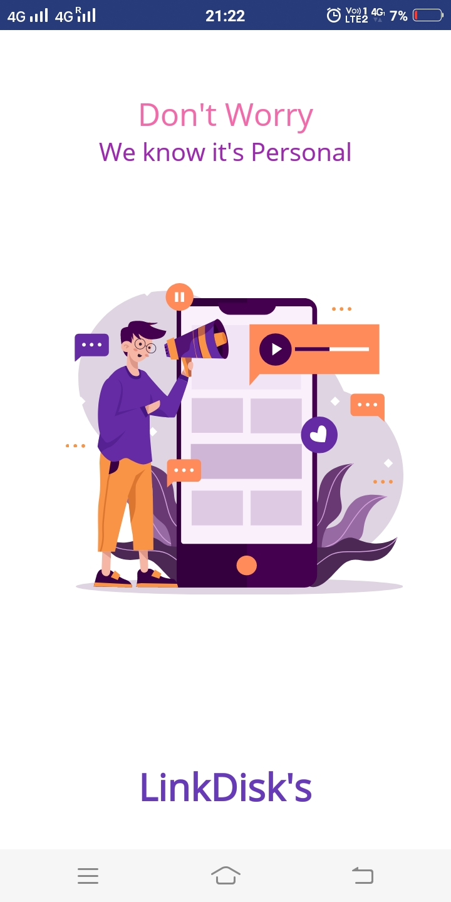  | 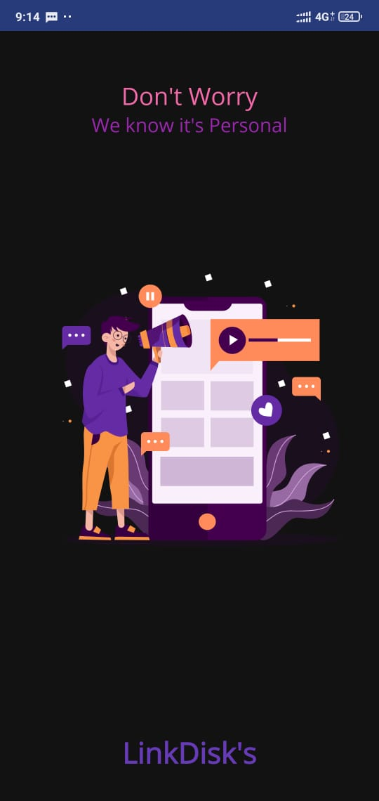
 

### Login System

 Login With Google Api             |  Generate or Enter Your Passcode
 :-------------------------:|:-------------------------:
  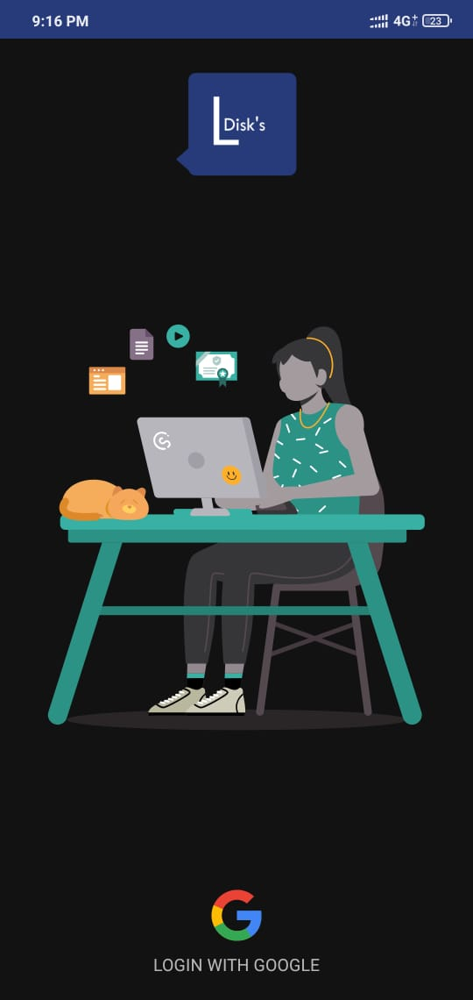  | 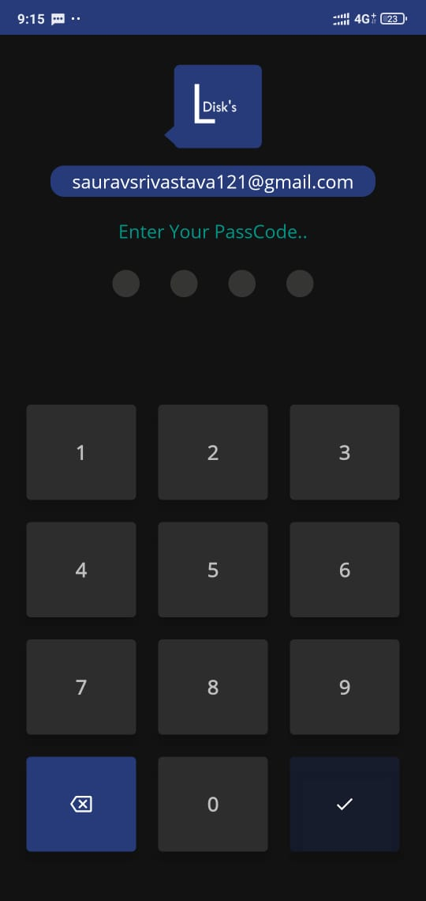
 

### light mode

Home             |  Settings         |  Add
:-------------------------:|:-------------------------:|:-------------------------:
 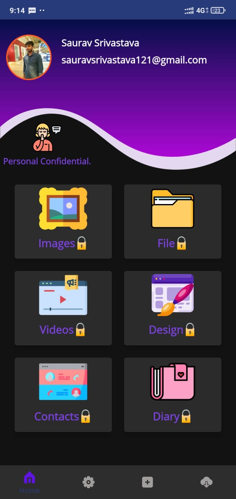  | 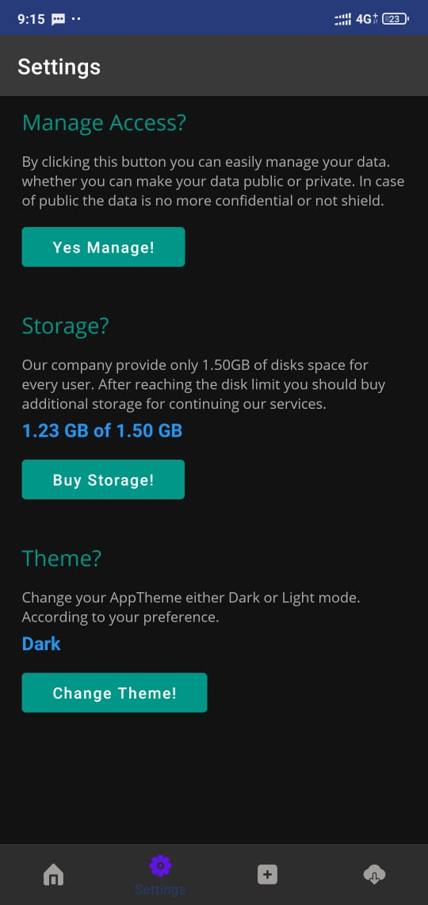 | 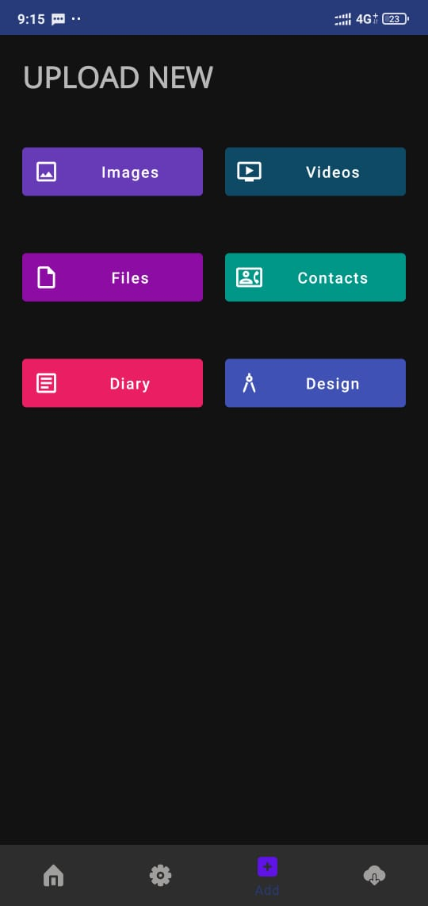

### Dark  mode

Home             |  Settings         |  Add
:-------------------------:|:-------------------------:|:-------------------------:
 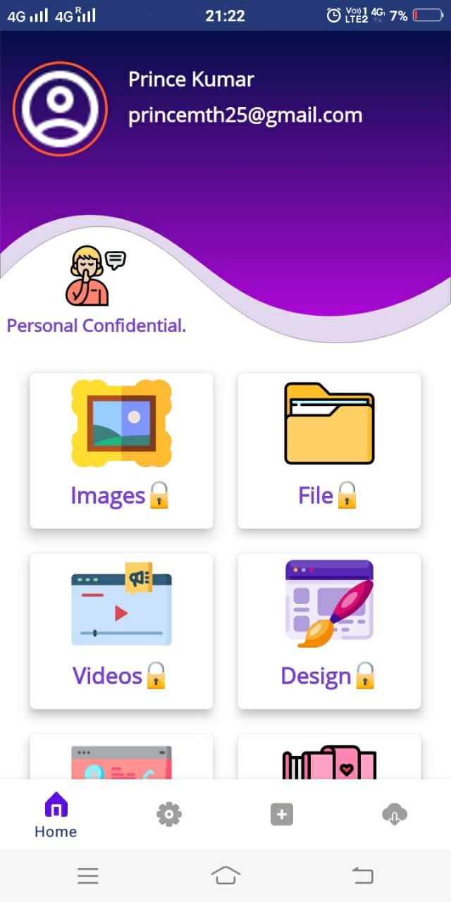  | 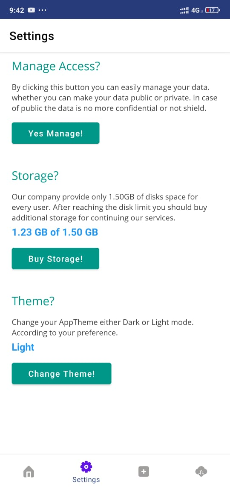 | 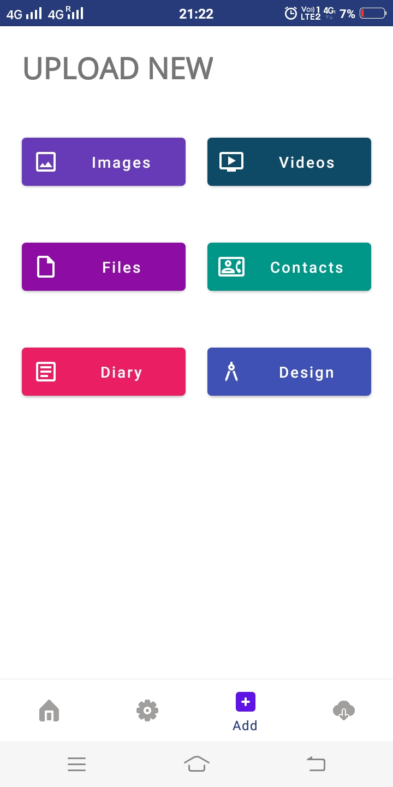

#Gallery

Light            |  Dark
:-------------------------:|:-------------------------:
 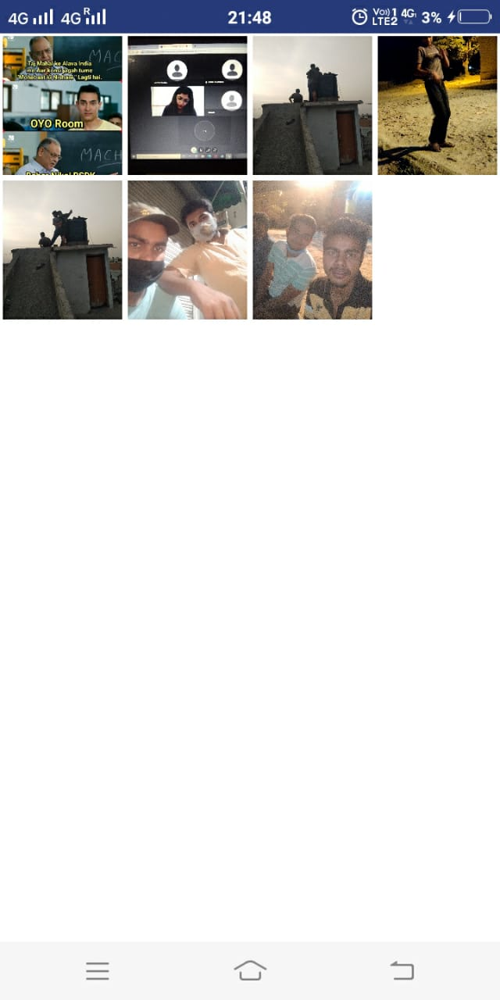  | 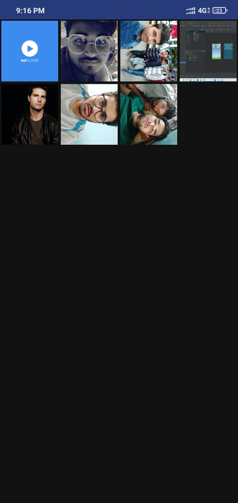
 
 
 #Video 
 Light            |  Dark
 :-------------------------:|:-------------------------:
  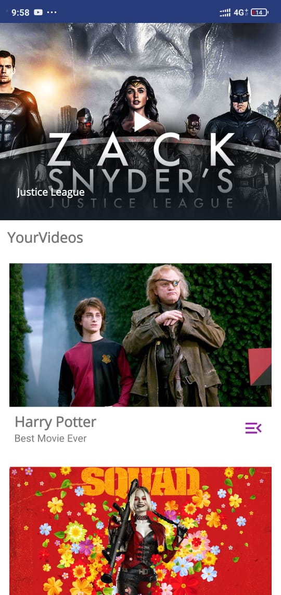  | 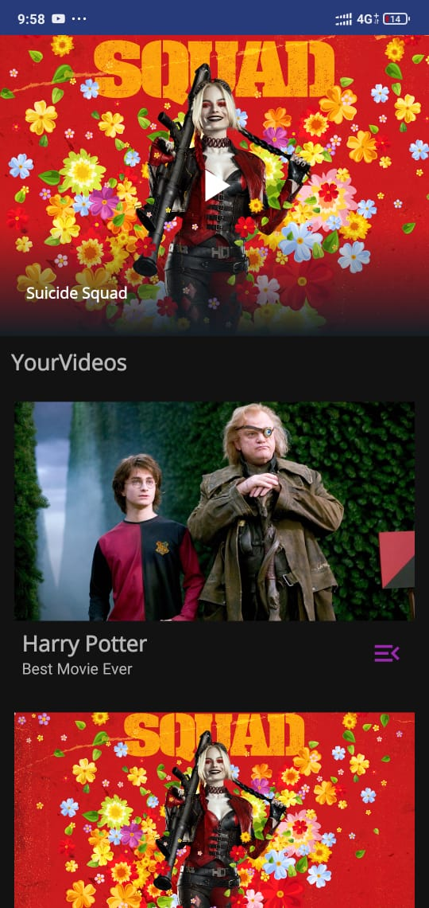

### This is how you can use our software

***
